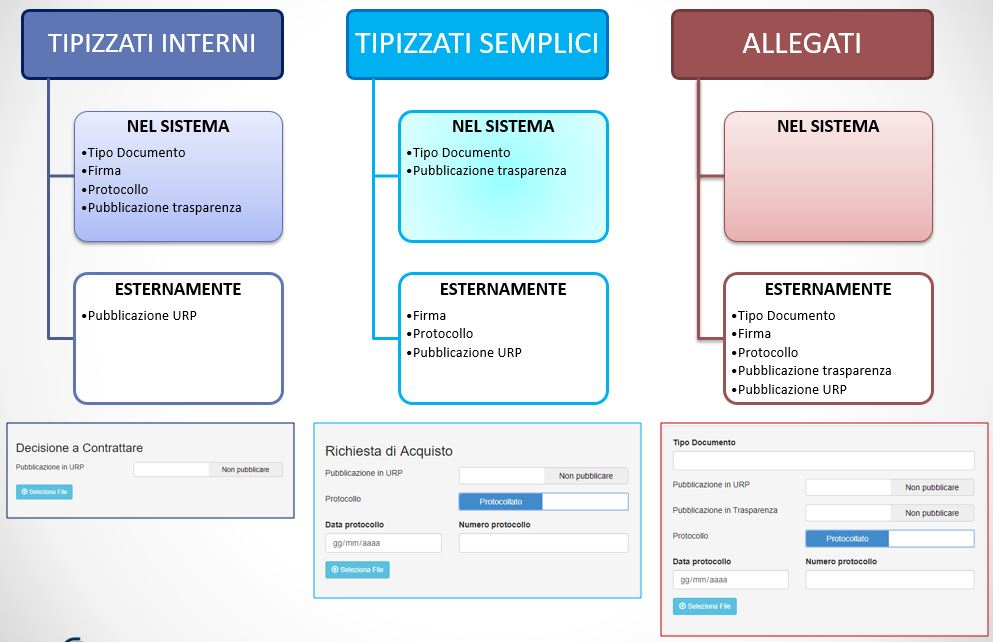
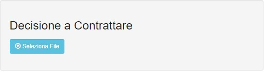
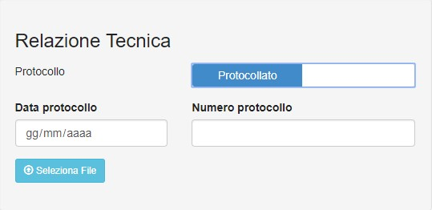
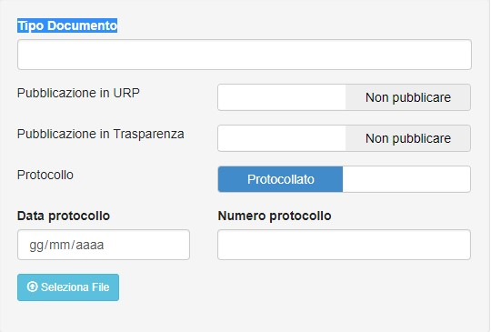
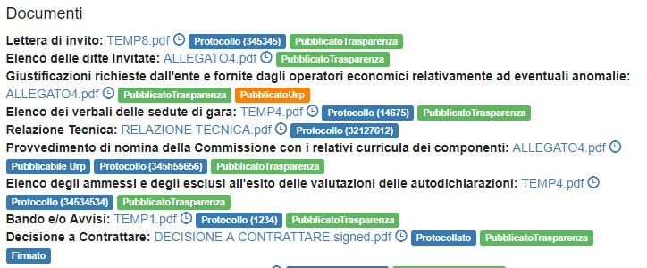
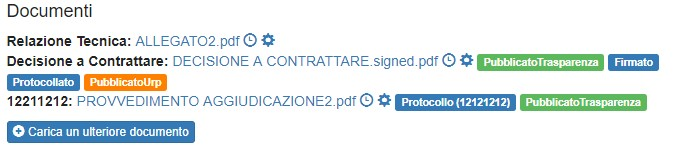
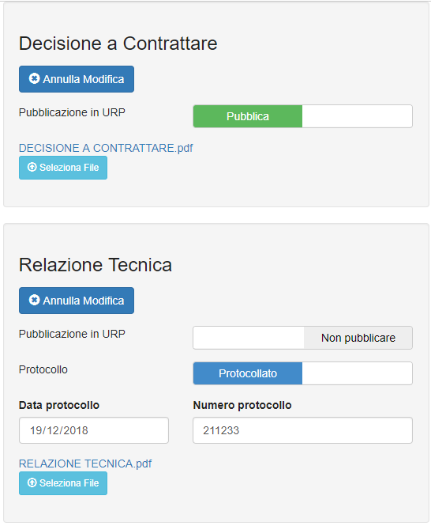

# GESTIONE DOCUMENTI

## Documenti tipo 1 - Documenti tipizzati gestiti Interamente da Sistema

Sono quei documenti &quot;definiti&quot; che vengono gestiti da Scrivania Digitale. Questi documenti vengono modificati, approvati, firmati e protocollati all'interno dell'applicazione. Il sistema prevede anche la gestione di default dei metadati associati (es. pubblicabile in Trasparenza / Urp)

 
Figura 12 – Caricamento Documenti Tipologia 1

## Documenti tipo 2 - Documenti tipizzati caricati nel Sistema

Sono documenti &quot;definiti&quot; che vengono caricati in Scrivania Digitale. Questi documenti vengono caricati all'interno dell'applicazione ma non vengono firmati e protocollati all'interno dell'applicazione. Parametri come il protocollo possono essere inseriti all'atto del caricamento.

 
Figura 13 - Caricamento Documenti Tipologia 2

## Documenti tipo 3 - Documenti Allegati

Sono quei documenti &quot;non definiti&quot; che vengono caricati in Scrivania Digitale. Per questi documenti deve essere specificato il &quot;Tipo Documento&quot; e tutti i metadati gestiti nei documenti di quel determinato flusso.

 
Figura 14 - Caricamento Documenti Tipologia 3

Documenti di questo tipo possono essere caricati extra-flusso da utenti con ruoli speciali mediante apposita interfaccia nei dettagli del flusso.

## Gestione della "etichette" in un flusso

Durante l'esecuzione dei vari Task del Flusso ciascun documento può essere etichettato con informazioni utili come ad esempio quello della pubblicazione sul portale dell'ente &quot;**pubblicabile in trasparenza**&quot; o &quot;**pubblicabile URP**".  La gestione di queste etichette dipende dalle specifiche di ogni flusso. Possiamo riportare un esempio della gestione di queste 2 etichette per il flusso "Acquisti":

- Per i documenti di tipo 1 e 2 viene gestita dal sistema.
- Per gli allegati (tipo 3) è settata da chi inserisce il documento; modificabile da altri utenti durante la gestione del proprio task (selezionando il bottone modifica).

Quando il sistema completa alcune fasi determinate, i documenti &quot;pubblicabili in trasparenza&quot; o &quot;pubblicabili URP&quot; saranno effettivamente resi rispettivamente disponibili per la pubblicazione in trasparenza e in URP. Le rispettive etichette cambieranno in "**PubblicatoTrasparenza**" o "**PubblicatoURP**".

 
Figura 15 - etichette sui documenti

## Gestione delle etichette - extra flusso

Ruoli che hanno permessi particolari possono in qualsiasi momento cambiare lo stato di pubblicazione di un documento. Per modificare i documenti basta andare sui dettagli del flusso e cliccare la &quot;rotellina&quot; relativa al documento che si vuole modificare come indicato in Figura 16

 
Figura 16 - gestione documenti extra flusso

## Gestione della pubblicazione - parametri di Protocollo (data e nr)

- Per i documenti di tipo 1 il protocollo viene inserito manualmente nei compiti (task) appositi. Al completamento con successo del Compito il documento verrà etichettato con l'etichetta &quot;Protocollato&quot;
- Per i documenti di tipo 2 e 3 sono settati da chi inserisce il documento modificabile da altri utenti durante la gestione del proprio task (selezionando il bottone modifica) e solo da ruoli specifici in qualsiasi momento). Al completamento con successo del Compito il documento verrà etichettato con l'etichetta &quot;Protocollo (nr protocollo)&quot;

È importante inserire sempre il numero di protocollo, perché è uno di quei parametri che può essere usato nel pannello Ricerca. Il risultato indicherà il flusso che possiede quel documento. Dai dettagli del flusso sarà possibile recuperare tutti i dati necessari e scaricare il file.

## Modifica Documenti

I documenti inseriti posso essere modificabili nel task (se il task lo prevede), o nella schermata dettagli dai ruoli a cui è stato dato il permesso di cambiarli. Potranno essere cambiati tutti i metadati e caricato un nuovo file in sostituzione del vecchio (nuova versione del documento) come già descritto nel paragrafo Gestione Documenti a meno che che il file non sia stato già firmato e protocollato (Documenti tipo 4)

## Documenti tipo 4 - Documenti Firmati e Protocollati all'interno di Scrivania Digitale

Sono quei documenti del tipo 1 che sono già stati firmati e protocollati all'interno dell'applicazione. Questi Documenti non possono essere modificati semplicemente. Utenti identificati come responsabili per quel specifico flusso e struttura hanno la possibilità di effettuare un cambiamento:

1. Per &quot;**Rettifica**&quot; per cui:
     - Verrà caricato un nuovo file di rettifica firmato e protocollato esternamente
     - Verrà inserito il suo nr di protocollo
     - Verranno copiati gli altri metadati dal documento principale
2. Per &quot;**Sostituzione**&quot; in quei casi di per cui:
     - Verrà caricato un nuovo file di rettifica firmato e protocollato esternamente in sostituzione del precedente (sarà una nuova versione dello stesso file)
     - Verrà inserito il suo nr di protocollo
     - Verranno copiati gli altri metadati dal documento principale
     - Verrà inserita la &quot;motivazione della sostituzione&quot;

 

