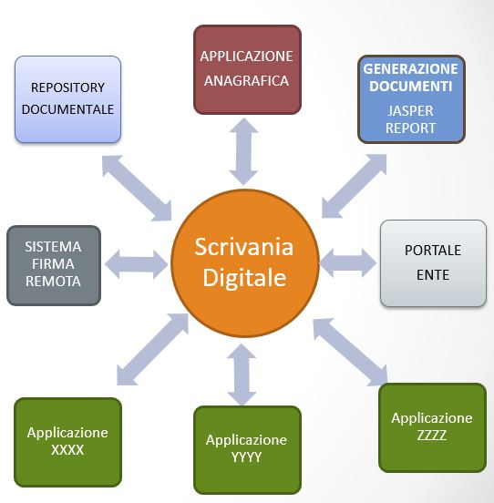

# INTRODUZIONE

Il presente manuale è una guida all'utilizzo di &quot;Scrivania Digitale&quot; come piattaforma per flussi di lavoro informatizzati - un'applicazione con interfaccia web che permette di definire ed eseguire flussi di lavoro che comportano l'assegnazione di compiti a diversi attori e la raccolta di informazioni e documentazione relativi alle attività amministrative.

Per Flusso (workflow) si intende l'automazione di un processo (procedure amministrative dell’ente). Un Flusso è costituito da una serie di attività elementari: compiti (task), eventualmente cicliche o alternative, da eseguire per ottenere un preciso risultato.

# LA SCRIVANIA DIGITALE

La "Scrivania Digitale" è un’applicazione web che permette la gestione dei flussi Documentali all’interno di un Ente, di un'azienda  o di una qualsiasi realtà strutturata di medie e grandi dimensioni.

La "Scrivania Digitale" ha come obiettivo principale quello di guidare gli utenti predisposti nella gestione dei vari  procedimenti amministrativi. In particolare è stata predisposta per:

- **Dematerializzare** (dematerializzazione del cartaceo)
- **Semplificare** (firma leggera, firma digitale, reingegnerizzazione)
- **Velocizzare** (smistamento ed assegnazione in automatico dei compiti ai diversi attori coinvolti);
- **Organizzare** (ogni utente ha la lista dei propri compiti)
- **Proteggere** (Migliora la protezione delle informazioni: permessi utenti)
- **Tracciare** (tracciamento delle attività con possibilità di monitoraggio dello stato di avanzamento)
- **Informare** (notifiche)
- **Armonizzare** (armonizzazione delle modalità operative di espletamento del procedimento amministrativo da parte delle diverse strutture)
- **Ottimizzare** (ottimizzazione dei processi amministrativi)
- **Facilitare** adempimento agli obblighi Normativi (es. per Acquisti adempimento automatico degli obblighi di trasparenza.)
- **Guidare** (guida e limita l’utente nelle azioni fornendo una maggior aderenza ai processi )
- **Supervisionare** (la ricerca dei flussi permette avere sotto controllo i processi)

Esistono 2 versioni di scrivania digitale, una versione "stand alone" ed una versione integrata.

## VERSIONE STAND ALONE

La versione "Stand Alone" di Scrivania Digitale è una versione che tende ad utilizzare quanto più possibile risorse interne rispetto ad applicazioni aggiuntive. Ad esempio non si appoggia a nessun Repository Documentale esterno per i documenti che vengono inseriti nel DB o nel filesystem locale. Utilizza un sistema interno per la profilazione, l'autenticazione e la gestione delle utenze e dei ruoli assegnati. 

## VERSIONE INTEGRATA	

La versione "Integrata" di Scrivania Digitale è una versione che tende ad integrare quanto più possibile risorse e applicazioni esterne sia open source e commerciali quali: un repository documentale esterno (es. Alfresco, Azure, ...), un sistema di firma remota (es. ARSS Aruba Sign Server); Questa versione è predisposta anche per integrarsi con applicazioni realizzate internamente come l'Anagrafica Centralizzata, e altre applicazioni che possono collegarsi direttamente a flussi specifici. Tali applicazioni avanno una propria gestione interna dei dati e si avvarranno di Scrivania per la parte amministrativa (es. firma digitale). 

