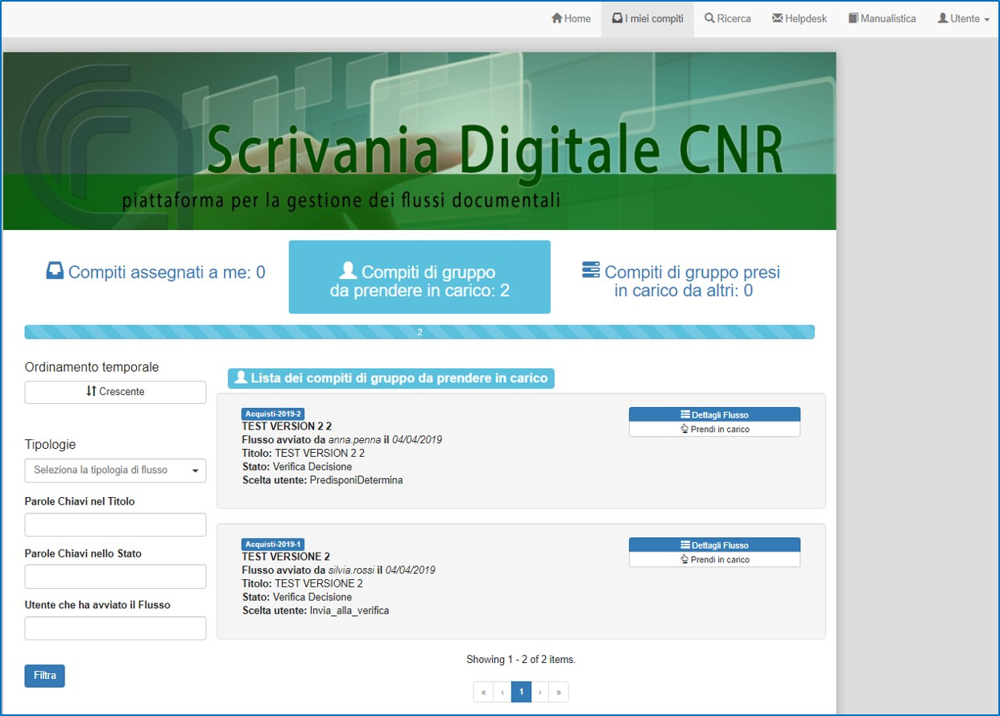
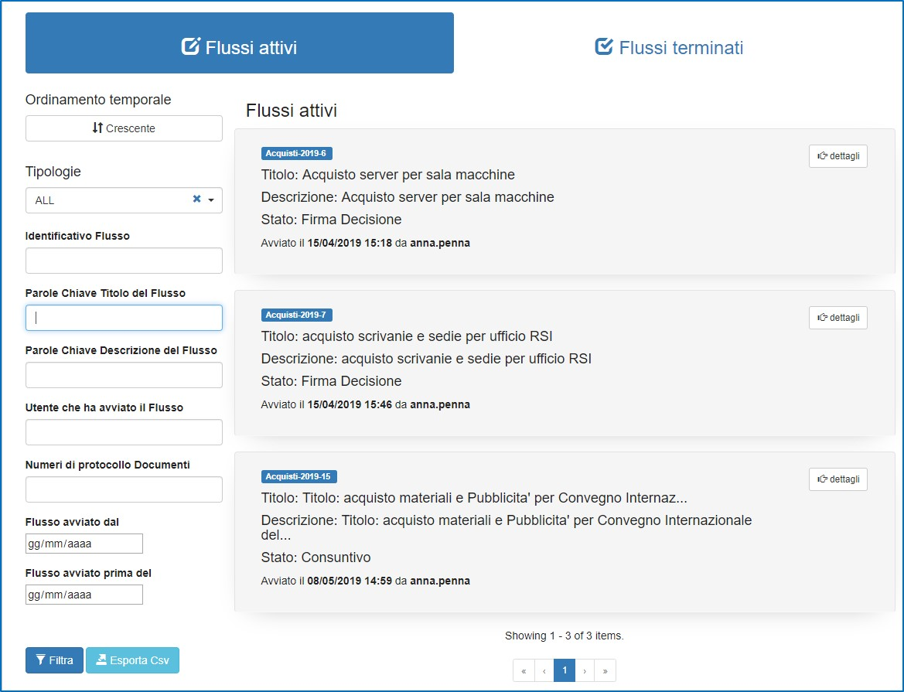

# VISUALIZZAZIONE

## LE PAGINE

Nella parte superiore della PAGINA appaiono le diverse voci del menù. Ogni utente ha sempre accesso alle seguenti voci del menù: “**I miei compiti**”, “**Ricerca**”, “**HelpDesk**”, “**Manualistica**” e “**Utente**”. Inoltre, a seconda dei ruoli ricoperti dall’utente in Scrivania Digitale, possono apparire altre voci più specifiche.

## I MIEI COMPITI

Il nome "scrivania digitale" deriva dalla trasposizione informatica di uno scenario reale di una scrivania fisica di un utente. Così come sulla scrivania si ha l'abitudine di organizzare le pratiche da lavorare, così la Scrivania Digitale presenta all'utente i vari compiti che devono essere svolti. 

Nella PAGINA “I miei compiti” apparirà così, al centro della pagina, la SEZIONE relativa ai “Compiti di gruppo da prendere in carico” ossia la lista di tutti quei compiti assegnati ad uno specifico ruolo che possono essere presi incarico o svolti dal gruppo di persone che ha quel determinato ruolo. 

Per eseguire un compito assegnato nella lista l’utente potrà scegliere se:

1. Prendere in carico il compito cliccando sulla voce “Prendi in carico”;
2. Visionare il flusso ed eventualmente svolgere il compito cliccando sulla voce “Dettagli Flusso”,

Cliccando, invece sulla voce “Prendi in carico”, quel compito sarà visibile nella SEZIONE di sinistra “compiti assegnati a me”. Questa lista mostra tutti quei compiti che l’utente ha preso in carico o gli sono stati assegnati direttamente. Per ogni compito in questa lista l’utente potrà scegliere se:

1. Restituire il compito al gruppo cliccando sulla voce “Restituisci al gruppo” e quindi renderlo di nuovo visibile nella SEZIONE centrale “Compiti di gruppo da prendere in carico”;
2. Svolgere direttamente il compito cliccando sulla voce “Dettagli Flusso”,

La SEZIONE di destra contiene la lista dei “compiti di gruppo presi in carico da altri” ossia la lista di tutti quei compiti presi in carico da altri utenti che appartengono a gruppi che hanno gli stessi ruoli dell’utente. 

Per ogni SEZIONE viene visualizzato il numero dei compiti presenti in quella specifica lista.

Nel pannello di sinistra è presente un filtro di ricerca che permette di filtrare e ordinare la visualizzazione dei compiti in base agli attributi principali dei flussi.

In ogni SEZIONE, cliccando sul pulsante “Dettagli” verrà visualizzata la PAGINA dei dettagli del flusso e, se disponibili all'utente, le azioni necessarie per il proseguimento del flusso.

## DETTAGLI FLUSSO  

In questa PAGINA sono contenute tutte le informazioni utili del flusso selezionato che possano permettere all’utente di eseguire quel compito specifico.

A sinistra sono presenti tutti i dati relativi alla specifica istanza di flusso.

A destra si ha il diagramma del flusso con evidenziato nello specifico il compito corrente. L’immagine piò essere ingrandita cliccando sopra la thumbnail. 

Tramite il pulsante “Visualizza Cronologia”, situato sotto il digramma è possibile vedere i dettagli dei compiti svolti fino ad ora su quell’istanza di flusso.

Tramite il pulsante “Export Summary” è possibile esportare un flie pdf contente le informazioni dei dettagli del flusso.

In basso a sinistra è presento l’elenco dei documenti che costituiscono il fascicolo per quella determinata istanza di flusso. Cliccando sul link del documento è possibile scaricarlo. Cliccando sull'iconcina a forma di orologio è possibile vederne la cronologia delle modifiche.

Centralmente in basso cliccando sul bottone “Azioni” si può accedere alla maschera con i form di caricamento informazioni e documenti specifici per quel compito. Una volta inserito le informazioni e i documenti necessari è possibile mandare avanti il compito cliccando sul bottone “Invia”. 

Cliccando il bottone “Invia” verranno messi in evidenza tutti i campi obbligatori del form che ancora non sono stati inseriti.

Se tutto va a buon fine il compito è terminato facendo proseguire il flusso verso il passo successivo. Il compito non è più presente nella lista de: “I MIEI COMPITI”. 

## RICERCA FLUSSI 

Nella PAGINA “Ricerca”, è possibile cercare i flussi di cui l’utente ha visibilità divisi in due SEZIONI:

- Quelli ancora attivi, visibili cliccando sul pulsante di sinistra “Flussi attivi” (è la SEZIONE di default)
- Quelli completati (qualunque sia l'esito), visibili cliccando sul pulsante di destra “Flussi completati”

Nella parte sinistra della PAGINA è presente una serie di campi di inserimento e selezione per filtrare i risultati. L’elenco può essere filtrato per attributi comuni ad ogni flusso quali: Identificativo Flusso, Parole Chiave Titolo del Flusso e Descrizione, Utente che ha avviato il Flusso, Numeri di protocollo Documenti e le date relative all’avvio del flusso. 

Selezionando la tipologia del flusso dall’elenco esposto nel campo “Tipologie” vengono presentati campi di filtro per quella tipologia di flusso in modo da poter avere a disposizione una ricerca più specifica.

L’elenco è, di default, ordinato per data di avvio crescente ossia dai flussi avviati prima a quelli più recenti. È possibile modificare l'ordinamento usando i contolli nella parte sinistra della PAGINA.

Una volta avuti i risultati della ricerca, cliccando sul pulsante “Dettagli” sarà visualizzata la PAGINA dove sono contenute tutte le informazioni utili relative a quel flusso.

Tramite il bottone "**Esporta Csv**" è possibile esportare i risultati della ricerca in formato .csv. Questo tipo di export è parametrizzabile per tipologia di flussi mediante il pannello di amministratore

## “HELPDESK”

Nella PAGINA “Help Desk”, è possibile, compilando l’apposito form, inviare una segnalazione all'Help Desk. Le tipologie sono distinte per: problemi Amministrativi e problemi tecnici.

## MANUALISTICA

Nella PAGINA “Manualistica” si trovano i link alla manualistica relativa ai vari tipi di flusso 

