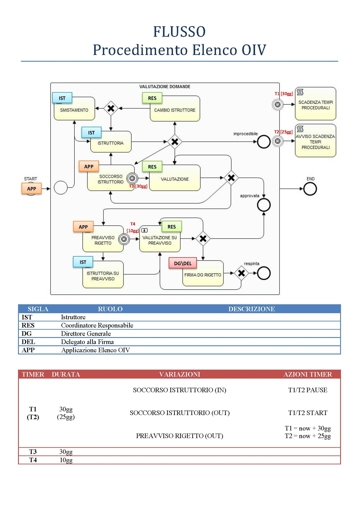
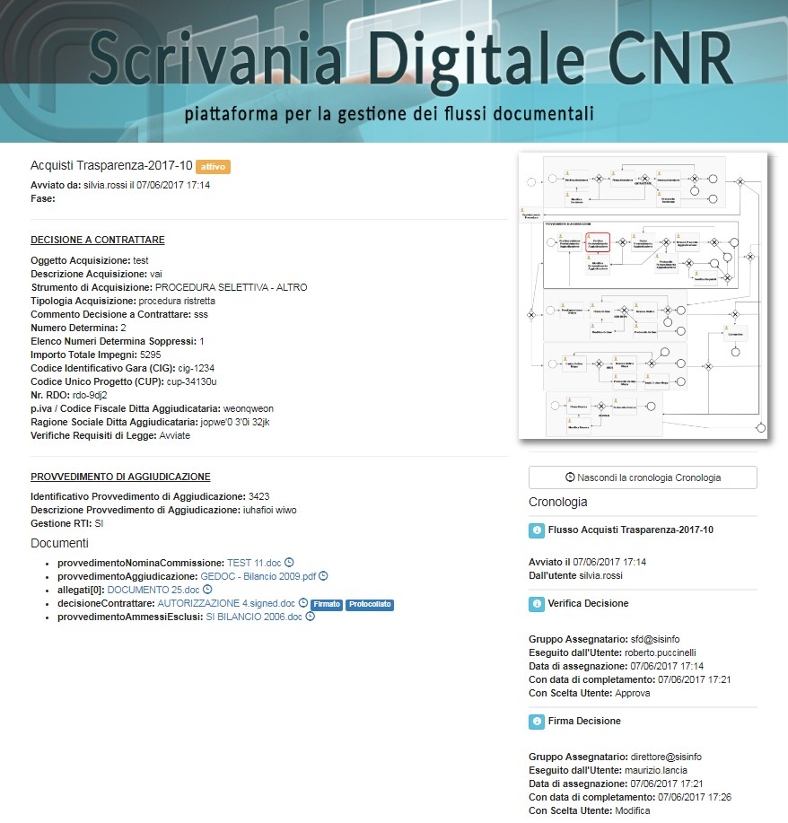
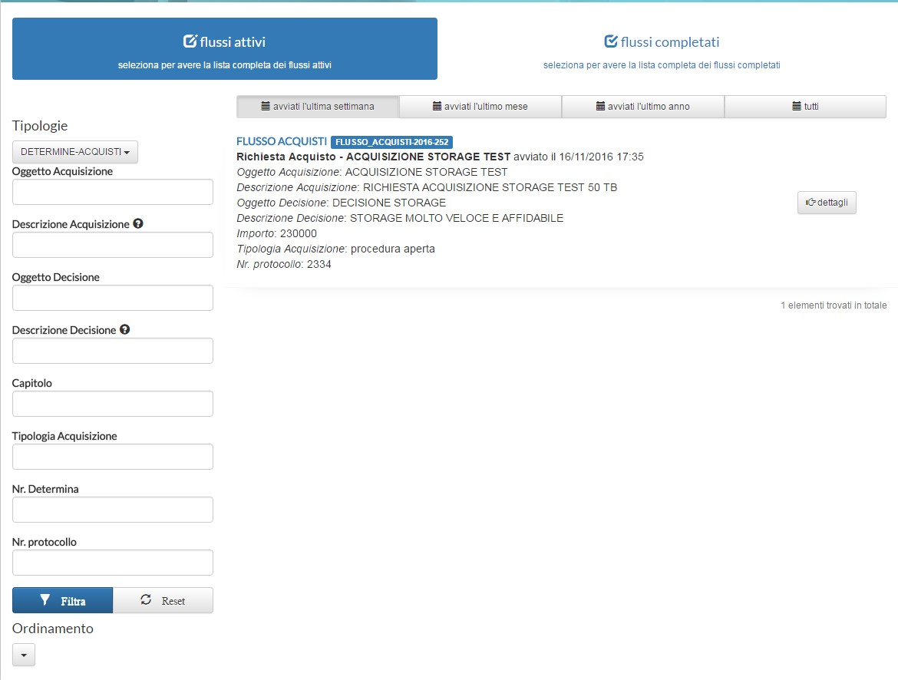

# SCRIVANIA DIGITALE

# FLUSSO procedimento elenco OIV

[TOC]

# DIAGRAMMA DI FLUSSO

# VISIBILITA&#39;

In questo capitolo si procederà nella descrizione dei requisiti per ogni task del flusso.

**VISIBILITA&#39;**

| RUOLO | FLUSSO  Documenti Metadati | FUNZIONALITÀ |
| --- | --- | --- |
| Responsabile Flusso | tutti | Cancellazione flussi (solo attivi)Cambio Assegnazione Task |
| Supervisore Flusso | tutti |   |
| Istruttore | Gestiti da lui |   |
| Coordinatore Responsabile | tutti |   |
| Direttore Generale / Delegato Firma | tutti |   |

# METADATI &amp; DOCUMENTI TASK

Nei prossimi paragrafi si procederà nella descrizione dei requisiti per ogni task del flusso.

## AVVIO DEL FLUSSO (START) - PREDISPOSIZIONE ISTRUTTORIA

Inserimento dati per avvio del flusso

**ATTORE (UTENTE/GRUPPO/APPLICAZIONE)**

- **Applicazione APP OIV (**[**https://elenco-oiv.performance.gov.it/**](https://elenco-oiv.performance.gov.it/)**)**

**SCELTE**

| SCELTA | descrizione |
| --- | --- |
| Avvia Flusso | L'Applicazione/Utente avvia il flusso |

**DOCUMENTI**

| DOCUMENTO | Insert/Update/Generated | Tipo | nr | Obbligatorio |
| --- | --- | --- | --- | --- |
| Domanda | Insert | pdf | 1 | SI |
| Carta di Identità | Insert | pdf | 1 | SI |
| Curriculum Vitae | Insert | pdf | 1 | SI |
| Allegati | Insert | pdf | 0-n | NO |

**NOTIFICHE**

| Destinatari | Tipologia Notifica | Dettagli Notifiche |
| --- | --- | --- |
| Coordinatore Responsabile | Flusso Iniziato |   |

**TIMER**

| TIMER | DURATA | descrizione |
| --- | --- | --- |
| T1 | 30gg | Durata massima per riscontro pratica |

**METADATI**

| Etichetta CAMPO | Tipo | Dettagli | Obbligatorio |
| --- | --- | --- | --- |
| Tipologia Richiesta | Selezione | Iscrizione /Rinnovo/ Modifica fascia | SI |
| ID Utenza Istruttore | id | userId | SI |
| Data di invio domanda | data |   | SI |
| Data decorrenza termini | data |   | SI |
| Cognome | Testo |   | SI |
| Nome | Testo |   | SI |
| Data di nascita | data |   | SI |
| Sesso | Selezione | [M/F] | SI |
| Codice Fiscale | Testo | Codice Fiscale | SI |
| Indirizzo mail | Testo | mail | SI |
| Fascia di Appartenenza | Selezione | 1/2/3 | SI |
| Data Iscrizione | Data |   |   |
| Stato attuale | Testo |   | SI |
| Codice di iscrizione in elenco (se il soggetto risulta già iscritto) | Testo |   | SI |
| ESPERIENZA /INCARICHI | Campo Strutturato | Nr /Dal – al /Codice IPA (selezione)/ Tipologia /Ambito /Attività Svolta (max 2000) | NO |
| Punteggio Esperienze Proposto | Autogenerato |   | SI |
| Fascia di Appartenenza proposta | Autogenerato | 1/2/3 | SI |
| Commento | Area di Testo | 3 righe | NO |

**NOTA INFORMATIVA**

Gestita dall&#39;applicazione **APP OIV**

## ISTRUTTORIA

**ATTORE (UTENTE/GRUPPO)**

- **Gruppo ISTRUTTORE**

**SCELTE**

| SCELTA | descrizione |
| --- | --- |
| Invia alla Valutazione | Invia alla Valutazione del Coordinatore Responsabile |
| Richiedi Soccorso Istruttorio | Richiesta del Soccorso Istruttorio\*(può essere richiesto solo 1 volta in tutto il flusso) |
| Domanda Improcedibile | Domanda Improcedibile \*(può dirigersi solo 1 volta in tutto il flusso verso il task  &quot;IMPROCEDIBILITA&#39;&quot; altrimenti fa terminare il flusso) |
| Richiedi Cambio Istruttore | Richiesta di Cambio Istruttore |

**METADATI**

| Etichetta CAMPO | Tipo | Dettagli | Obbligatorio |   |
| --- | --- | --- | --- | --- |
| STATO DOMANDA | Autogenerato | ISTRUTTORIA | - |   |
| Approvare/Respingere | Selezione | Approvare/Respingere | SI |   |
| Anomalie | Bullett | Anomalia su Cv /Anomalia su Documento /Anomalia su Esperienze /Nessuna | SI(solo per scelta &quot;Domanda Improcedibile&quot;) |   |
| Motivazione | Area di Testo | 3 righe | SI(solo per scelta &quot;Richiesta di Cambio Istruttore&quot;) |   |
| ESPERIENZA /INCARICHI | Campo Strutturato | Nr /Dal – al /Codice IPA (selezione)/ Tipologia /Ambito /Attività Svolta (max 2000) | SIPer soccorso Istruttorio |   |
| Osservazioni generali soccorso | Area di Testo | 3 righe | SI(solo per scelta &quot;Soccorso istruttorio&quot;) |   |
| Tempo di Soccorso Istruttorio | Autogenerato | Data | Se proveniente da SOCCORSO ISTRUTTORIO |
| Commento | Area di Testo | 3 righe | SI |   |

**DOCUMENTI**

| DOCUMENTO | Insert/Update/Generated | Tipo | nr | Obbligatorio |
| --- | --- | --- | --- | --- |
| Allegati | Insert | pdf | 0-n | NO |

**NOTIFICHE**

| Destinatari | Tipologia Notifica | Dettagli Notifiche |
| --- | --- | --- |
| Gruppo Istruttori | Compito Assegnato | Nessuno |

**NOTA INFORMATIVA**

&quot;L'Istruttore verifica

- tramite l&#39;azione &#39;Invia alla Valutazione&#39; la domanda potrà essere gestita dal Coordinatore Responsabile.

- tramite l&#39;azione &#39;Soccorso Istruttorio&#39; la domanda verrà gestita dall'applicazione che permetterà all'utente di inserire i documenti necessari a completare la sua domanda.

- tramite l&#39;azione &#39;Cambio Istruttore&#39; verrà richiesto Coordinatore Responsabile di poter rilasciare la gestione della pratica.

## IMPROCEDIBILITA&#39;

**ATTORE (UTENTE/GRUPPO)**

- **Applicazione APP OIV (**[**https://elenco-oiv.performance.gov.it/**](https://elenco-oiv.performance.gov.it/)**)**

**SCELTE**

| SCELTA | descrizione |
| --- | --- |
| Invia all'Istruttoria | Invia all'Istruttoria |

**METADATI**

| Etichetta CAMPO | Tipo | Dettagli | Obbligatorio |
| --- | --- | --- | --- |
| STATO DOMANDA | Autogenerato | IMPROCEDIBILITA&#39; | - |
| Commento | Area di Testo | 3 righe | SI |

**TIMER**

| TIMER | DURATA | descrizione |
| --- | --- | --- |
| T2 | 30gg | Timer perché la domanda venga giudicata definitivamente &quot;IMPROCEDIBILE &quot; |

**DOCUMENTI**

| DOCUMENTO | Insert/Update/Generated | Tipo | nr | Obbligatorio |
| --- | --- | --- | --- | --- |
| Domanda | Update | pdf | 1 | SI |
| Carta di Identità | Update | pdf | 1 | SI |
| Curriculum Vitae | Update | pdf | 1 | SI |
| Allegati | Update | pdf | 0-n | NO |

**NOTIFICHE**

Gestita dall'applicazione **APP OIV**

**NOTA INFORMATIVA**

Gestita dall'applicazione **APP OIV**

## SOCCORSO ISTRUTTORIO

**ATTORE (UTENTE/GRUPPO/APPLICAZIONE)**

- **Applicazione APP OIV (**[**https://elenco-oiv.performance.gov.it/**](https://elenco-oiv.performance.gov.it/)**)**

**SCELTE**

| SCELTA | descrizione |
| --- | --- |
| Invia all'Istruttoria | Invia alla Istruttore |

**TIMER**

| TIMER | DURATA | descrizione |
| --- | --- | --- |
| T3 | 30gg | Timer perché il Soccorso istruttorio passi direttamente alla &quot;VALUTAZIONE&quot; |

**METADATI (scelta &quot;Prosegui Istruttoria&quot;)**

| Etichetta CAMPO | Tipo | Dettagli | Obbligatorio |
| --- | --- | --- | --- |
| STATO DOMANDA | Autogenerato | SOCCORSO ISTRUTTORIO | - |
| Richiesto Soccorso Istruttorio (Flag) | Autogenerato | Si/no | - |
| Data Invio Soccorso Istruttorio | Autogenerato | Data | - |
| Data Termine Soccorso Istruttorio | Autogenerato | now + 30gg | - |
| Data Comunicazione Utente | Autogenerato | data | - |
| ESPERIENZA /INCARICHI | Campo Strutturato |
- Nr /Dal – al /Codice IPA (selezione)/ Tipologia /Ambito /Attività Svolta (max 2000)
 | NO |
| Punteggio Esperienze Proposto | Autogenerato |   | SI |
| Fascia di Appartenenza proposta | Autogenerato | 1/2/3 | SI |
| Commento | Area di Testo | 3 righe | NO |

**DOCUMENTI**

| DOCUMENTO | Insert/Update/Generated | Tipo | nr | Obbligatorio |
| --- | --- | --- | --- | --- |
| Allegati | Insert | pdf | 0-n | NO |

**NOTIFICHE**

Gestita dall'applicazione **APP OIV**

**NOTA INFORMATIVA**

Gestita dall'applicazione **APP OIV**

## CAMBIO ISTRUTTORE

**ATTORE (UTENTE/GRUPPO/APPLICAZIONE)**

- **Coordinatore Responsabile**

**SCELTE**

| SCELTA | descrizione |
| --- | --- |
| Approva Cambio Istruttore | Approva Cambio Istruttore |
| Nega Cambio Istruttore | Nega Cambio Istruttore |

**METADATI (scelta &quot;**Approva Cambio Istruttore**&quot;)**

| Etichetta CAMPO | Tipo | Dettagli | Obbligatorio |
| --- | --- | --- | --- |
| STATO DOMANDA | Autogenerato | CAMBIO ISTRUTTORE | - |
| Commento | Area di Testo | 3 righe | NO |

**METADATI (scelta &quot;**Nega Cambio Istruttore**&quot;)**

| Etichetta CAMPO | Tipo | Dettagli | Obbligatorio |
| --- | --- | --- | --- |
| STATO DOMANDA | Autogenerato | CAMBIO ISTRUTTORE | - |
| Commento | Area di Testo | 3 righe | SI |

**NOTIFICHE**

| Destinatari | Tipologia Notifica | Dettagli Notifiche |
| --- | --- | --- |
| Coordinatore Responsabile | Compito Assegnato |   |

**NOTA INFORMATIVA**

Il Coordinatore Responsabile

-tramite l&#39;azione &#39;Approva Cambio Istruttore&#39; può concedere il cambio istruttore per la domanda specifica. La domanda potrà essere presa in carico da un altro Istruttore.&quot;

- tramite l&#39;azione &#39;Nega Cambio Istruttore&#39; il precedente Istruttore dovrà continuare la gestione della domanda. In questo caso il Coordinatore Responsabile dovrà specificare la scelta motivandola nel campo commento.

## VALUTAZIONE

**ATTORE (UTENTE/GRUPPO/APPLICAZIONE)**

- **Coordinatore Responsabile**

**SCELTE**

| SCELTA | descrizione |
| --- | --- |
| Richiedi Soccorso istruttorio | Richiedi Soccorso istruttorio\*(può essere richiesto solo 1 volta in tutto il flusso) |
| Approva | Approva Domanda |
| Genera PDF Preavviso di Rigetto | Genera PDF Preavviso di Rigetto |
| Proponi per Preavviso di Rigetto | Proponi per Preavviso di Rigetto |
| Calcola Punteggio e Fascia | Calcola Punteggio e Fascia |

**METADATI (valide per qualsiasi scelta)**

| Etichetta CAMPO | Tipo | Dettagli | Obbligatorio |
| --- | --- | --- | --- |
| STATO DOMANDA | Autogenerato | VALUTAZIONE | - |
| ID Utenza Validatore | Autogenerato | userid |   |
| Richiesto Soccorso Istruttorio | Autogenerato | Si | - |
| Nr. esperienze ko | Autogenerato | numerico | - |
| Motivazione | Area di Testo | 3 righe | SI |

**METADATI (scelta &quot;Richiedi Soccorso istruttorio&quot;)**

| Etichetta CAMPO | Tipo | Dettagli | Obbligatorio |
| --- | --- | --- | --- |
| Richiesto Soccorso Istruttorio | Autogenerato | Si | - |
| Testo Soccorso istruttorio | Area di Testo | 3 righe | SI |

**METADATI (scelta &quot;Approva&quot;)**

| Etichetta CAMPO | Tipo | Dettagli | Obbligatorio |
| --- | --- | --- | --- |
| ESPERIENZA /INCARICHI | Campo Strutturato | Annotazione del Valutatore / Flag OK/KO | SI |
| Stato Finale | Autogenerato | Approvata | - |
| Punteggio Esperienze Attribuito | Autogenerato | Intero | - |
| Fascia Attribuita | Autogenerato | Intero | - |

**METADATI (scelta &quot;Proponi per Preavviso di Rigetto&quot; e &quot;Genera PDF Preavviso di Rigetto&quot;)**

| Etichetta CAMPO | Tipo | Dettagli | Obbligatorio |
| --- | --- | --- | --- |
| ESPERIENZA /INCARICHI | Campo Strutturato | Annotazione del Valutatore / Flag OK/KO | SI |
| Motivazione Standard (Flag) | Boolean | Si/No | SI |
| Rigetto Per Decorso dei termini di Presentazione delle osservazioni | Autogenerato | Si (T2 scaduto)No (proveniente sa ISTRUTTORIA) | - |
| Punteggio Esperienze Attribuito | Autogenerato | Intero | - |
| Fascia Attribuita | Autogenerato | Intero | - |

**NOTIFICHE**

| Destinatari | Tipologia Notifica | Dettagli Notifiche |
| --- | --- | --- |
| Coordinatore Responsabile | Compito Assegnato |   |

**NOTA INFORMATIVA**

Il Coordinatore Responsabile

-tramite l&#39;azione &#39;Approva&#39; da un riscontro positivo alla domanda facendo terminare il flusso in STATO &quot;approvato&quot;

- tramite l&#39;azione &#39;Richiedi Soccorso istruttorio&#39; la domanda verrà gestita dall&#39;applicazione che permetterà all&#39;utente di inserire i documenti necessari a completare la sua domanda. In questo caso dovrà specificare la scelta motivandola nel campo commento

- tramite l&#39;azione &quot;Genera PDF Preavviso di Rigetto&quot; genera il pdf che verrà inserito nei documenti disponibili. - tramite l&#39;azione &#39;Proponi per Preavviso di Rigetto&#39; propone al Direttore Generale il rigetto della domanda motivando la scelta nel campo commento

## FIRMA DG PREAVVISO RIGETTO

**ATTORE (UTENTE/GRUPPO)**

- **Direttore Generale**

**SCELTE**

| SCELTA | descrizione |
| --- | --- |
| Invia Preavviso di Rigetto | Invia il Preavviso di Rigetto |
| Rimanda in Valutazione | Rimanda in Valutazione |

**METADATI**

| Etichetta CAMPO | Tipo | Dettagli | Obbligatorio |
| --- | --- | --- | --- |
| STATO DOMANDA | Autogenerato | FIRMA DG PREAVVISO RIGETTO | - |
| Nr. esperienze ko | Autogenerato | numerico | - |
| ESPERIENZA /INCARICHI | Campo Strutturato | Annotazione del Dirigente /Flag OK/KO | SI |
| Punteggio Esperienze Attribuito | Autogenerato | Intero | - |
| Nome e Cognome Firmatario Rigetto Preavviso | Autogenerato |   | - |
| Delega Rigetto Preavviso | Autogenerato | Si/No | - |
| Data Protocollo | data |   | Si |
| Nr protocollo | testo |   | SI |
| Commento | Area di Testo | 3 righe | SI |

**DOCUMENTI**

| DOCUMENTO | Insert/Update/Generated | Tipo | nr | Obbligatorio |
| --- | --- | --- | --- | --- |
| Preavviso di Rigetto | Generated/Update | pdf | 1 | SI |

**NOTIFICHE**

| Destinatari | Tipologia Notifica | Dettagli Notifiche |
| --- | --- | --- |
| Direttore Generale / Delegato | Compito Assegnato |   |

**NOTA INFORMATIVA**

Il Dirigente ha il compito di compilare i dati della form

- tramite l&#39;azione &#39;Invia Preavviso di Rigetto&#39; il Preavviso di Rigetto potrà essere gestita dall&#39;applicazione Elenco OIV che la metterà a disposizione del richiedente.

- tramite l&#39;azione &#39;Manda in Valutazione&#39; la domanda verrà risottoposta al Valutatore.

## PREAVVISO RIGETTO

**ATTORE (UTENTE/GRUPPO/APPLICAZIONE)**

- **Applicazione APP OIV (**[**https://elenco-oiv.performance.gov.it/**](https://elenco-oiv.performance.gov.it/)**)**

**SCELTE**

| SCELTA | descrizione |
| --- | --- |
| Prosegui Istruttoria | Invia alla Istruttoria |

**TIMER**

| TIMER | DURATA | descrizione |
| --- | --- | --- |
| T1 | T1 = now + 30gg | Timer riparte con scadenza 30gg |
| T4 | 10gg | Timer per la risposta al &quot;Preavviso di Rigetto&quot; |

**METADATI (scelta &quot;Prosegui Istruttoria&quot;)**

| Etichetta CAMPO | Tipo | Dettagli | Obbligatorio |
| --- | --- | --- | --- |
| STATO DOMANDA | Autogenerato | PREAVVISO RIGETTO | - |
| Nr. esperienze ko | Autogenerato | numerico | - |
| Data Termine Preavviso Rigetto | Autogenerato | now + 10gg |   |
| Osservazioni Richiedente | Area di Testo | 5 righe | SI |
| Data Comunicazione Utente | Autogenerato | data | - |
| Commento | Area di Testo | 3 righe | NO |

**DOCUMENTI**

| DOCUMENTO | Insert/Update/Generated | Tipo | nr | Obbligatorio |
| --- | --- | --- | --- | --- |
| Allegati | Insert | pdf | 0-n | NO |

**NOTIFICHE**

Gestita dall&#39;applicazione **APP OIV**

**NOTA INFORMATIVA**

Gestita dall&#39;applicazione **APP OIV**

## ISTRUTTORIA SU PREAVVISO

**ATTORE (UTENTE/GRUPPO)**

- **Gruppo ISTRUTTORE**

**SCELTE**

| SCELTA | descrizione |
| --- | --- |
| Invia alla Valutazione | Invia alla Valutazione del Coordinatore Responsabile |

**METADATI**

| Etichetta CAMPO | Tipo | Dettagli | Obbligatorio |
| --- | --- | --- | --- |
| STATO DOMANDA | Autogenerato | ISTRUTTORIA SU PREAVVISO | - |
| Giorni di Preavviso Rigetto | Autogenerato | Nr giorni | - |
| Anomalie | Selezione | Anomalia su Cv /Anomalia su Documento /Anomalia su Esperienze /Nessuna | SI |
| Commento | Area di Testo | 3 righe | SI |

**DOCUMENTI**

| DOCUMENTO | Insert/Update/Generated | Tipo | nr | Obbligatorio |
| --- | --- | --- | --- | --- |
| Allegati | Insert | pdf | 0-n | NO |

**NOTIFICHE**

| Destinatari | Tipologia Notifica | Dettagli Notifiche |
| --- | --- | --- |
| Gruppo Istruttori | Compito Assegnato |   |

**NOTA INFORMATIVA**

&quot;L&#39;Istruttore verifica

XXXXXXXXXXXXXXXXXXXXXXXXXXXXX

- tramite l&#39;azione &#39;Invia alla Valutazione&#39; la domanda potrà essere gestita dal Coordinatore Responsabile.

## VALUTAZIONE SU PREAVVISO

**ATTORE (UTENTE/GRUPPO/APPLICAZIONE)**

- **Coordinatore Responsabile**

**SCELTE**

| SCELTA | descrizione |
| --- | --- |
| Approva | Approva Domanda |
| Proponi per Rigetto | Proponi per Rigetto |
| Genera PDF Avviso di Rigetto | Genera PDF Avviso di Rigetto |

**METADATI (scelta &quot;Approva&quot;)**

| Etichetta CAMPO | Tipo | Dettagli | Obbligatorio |
| --- | --- | --- | --- |
| STATO DOMANDA | Autogenerato | VALUTAZIONE SU PREAVVISO | - |
| Valutazione Osservazioni Richiedente | Area di Testo | Annotazione del Valutatore | SI |
| Flag Valutazione Osservazioni Richiedente | Boolean | Flag OK/KO | SI |
| Motivazione | Area di Testo | 3 righe | SI |
| Punteggio Esperienze Proposto | Autogenerato |   | SI |
| Fascia di Appartenenza proposta | Autogenerato | 1/2/3 | SI |
| Motivazione Standard (Flag) | Boolean | Si/No | SI |

**METADATI (scelta &quot;Proponi per Rigetto&quot;)**

| Etichetta CAMPO | Tipo | Dettagli | Obbligatorio |
| --- | --- | --- | --- |
| STATO DOMANDA | Autogenerato | VALUTAZIONE SU PREAVVISO | - |
| Valutazione Osservazioni Richiedente | Area di Testo | Annotazione del Valutatore | SI |
| Flag Valutazione Osservazioni Richiedente | Boolean | Flag OK/KO | SI |
| Motivazione | Area di Testo | 3 righe | SI |
| Rigetto per Decorso termini di Presentazione delle Osservazioni (Flag) | Autogenerato | Si (T4 scaduto)No (proveniente sa ISTRUTTORIA) | - |
| Motivazione Standard (Flag) | Boolean | Si/No(presente se non T4 scaduto) | SI |

**NOTIFICHE**

| Destinatari | Tipologia Notifica | Dettagli Notifiche |
| --- | --- | --- |
| Coordinatore Responsabile | Compito Assegnato |   |   |
| APP OIV / Istruttore | Flusso Terminato | Per scelta &quot;Approva&quot; |

**NOTA INFORMATIVA**

Il Coordinatore Responsabile

-tramite l&#39;azione &#39;Approva&#39; da un riscontro positivo alla domanda facendo terminare il flusso in STATO &quot;approvato&quot;

- tramite l&#39;azione &quot;Genera PDF Avviso di Rigetto&quot; genera il pdf che verrà inserito nei documenti disponibili.

- tramite l&#39;azione &#39;Proponi per Rigetto&#39; propone al Direttore Generale il rigetto della domanda motivando la scelta nel campo &quot;Motivazione&quot;.

## FIRMA DG RIGETTO

**ATTORE (UTENTE/GRUPPO)**

- **Direttore Generale**

**SCELTE**

| SCELTA | descrizione |
| --- | --- |
| Invia Avviso di Rigetto | Invia Avviso di Rigetto |
| Riproponi alla Valutazione | Riproponi alla Valutazione |

**METADATI**

| Etichetta CAMPO | Tipo | Dettagli | Obbligatorio |
| --- | --- | --- | --- |
| STATO DOMANDA | Autogenerato | FIRMA DG RIGETTO | - |
| Nome e Cognome Firmatario Rigetto | Autogenerato |   | - |
| Delega Rigetto | Autogenerato | Si/No | - |
| Valutazione Dirigente Osservazioni Richiedente | Area di Testo | Annotazione del Valutatore | SI |
| Flag Valutazione Dirigente Osservazioni Richiedente | Boolean | Flag OK/KO | SI |
| Motivazione Standard (Flag) | Boolean | Si/No(presente se non T4 scaduto) | SI |
| Motivazione | Area di Testo | 3 righe | SI |
| Data Protocollo | data |   | Si |
| Nr protocollo | testo |   | SI |

**DOCUMENTI**

| DOCUMENTO | Insert/Update/Generated | Tipo | nr | Obbligatorio |
| --- | --- | --- | --- | --- |
| Avviso di Rigetto | Generated | pdf | 1 | - |

**NOTIFICHE**

| Destinatari | Tipologia Notifica | Dettagli Notifiche |
| --- | --- | --- |
| Direttore generale / Delegato | Compito Assegnato |   |
| APP OIV/ Istruttore / Coordinatore Responsabile | Flusso Terminato | APP OIV dovrà inviare al richiedente il file dell&#39;Avviso di Rigetto Firmatoin allegato |

**NOTA INFORMATIVA**

Il Dirigente ha il compito di compilare i dati della form

- tramite l&#39;azione &#39;Invia Avviso di Rigetto&#39; il Preavviso di Rigetto potrà essere gestita dall'applicazione Elenco OIV che la metterà a disposizione del richiedente.

- tramite l&#39;azione &#39;Reinvia alla Valutazione&#39; la domanda verrà sottoposta nuovamente alla valutazione

## SCADENZA TEMPI PROCEDURALI

- **TASK DI NOTIFICA**

**NOTIFICHE**

| Destinatari | Tipologia Notifica | Dettagli Notifiche |
| --- | --- | --- |
| Istruttore / Coordinatore Responsabile | Flusso Terminato | Generata a seguito della scadenza dei Timer T1 e T3 |

## TERMINE FLUSSO

**METADATI (&quot;improcedibile &quot;)**

| Etichetta CAMPO | Tipo | Dettagli | Obbligatorio |
| --- | --- | --- | --- |
| STATO DOMANDA | Autogenerato | DOMANDA IMPROCEDIBILE | - |
| Tempo totale Istruttoria | Autogenerato | Numero gg | SI |

**METADATI (&quot;rigettata&quot;)**

| Etichetta CAMPO | Tipo | Dettagli | Obbligatorio |
| --- | --- | --- | --- |
| STATO DOMANDA | Autogenerato | DOMANDA RIGETTATA | - |
| Domanda Oltre Tempi di Scadenza (Flag) | Autogenerato | Si/No | - |
| Tempo totale Istruttoria | Autogenerato | Numero gg | SI |

**METADATI (&quot;approvata&quot;)**

| Etichetta CAMPO | Tipo | Dettagli | Obbligatorio |
| --- | --- | --- | --- |
| STATO DOMANDA | Autogenerato | DOMANDA APPROVATA | - |
| Tempo totale Istruttoria | Autogenerato | Numero gg | SI |

**DOCUMENTI**

| DOCUMENTO | Insert/Update/Generated | Tipo | nr | Obbligatorio |
| --- | --- | --- | --- | --- |
| summary | Generated/Update | pdf | 1 | SI |

**NOTIFICHE**

| Destinatari | Tipologia Notifica | Dettagli Notifiche |
| --- | --- | --- |
| Istruttore / Coordinatore Responsabile | Flusso Terminato |   |

# ELENCO METADATI &quot;DETTAGLI FLUSSO&quot;

Nelle pagine relative ai dettagli della singola istanza del flusso saranno visibili, se valorizzati, i campi riportati nella seguente tabella.

| TIPOLOGIA DATO | ETICHETTA CAMPO | VISUALIZZAZIONE | RICERCA |
| --- | --- | --- | --- |
| DATI FLUSSO | Identificativo Flusso | SI | SI |
| DATI RICHIEDENTE | Cognome | SI | SI |
| DATI RICHIEDENTE | Nome | SI | SI |
| DATI RICHIEDENTE | Data di nascita | SI | NO |
| DATI RICHIEDENTE | Sesso | SI | NO |
| DATI RICHIEDENTE | Codice Fiscale | SI | SI |
| DATI RICHIEDENTE | Indirizzo mail | NO | NO |
| DATI RICHIEDENTE | Fascia di Appartenenza | SI | SI |
| DATI RICHIEDENTE | Data Iscrizione | SI | NO |
| DATI RICHIEDENTE | Codice di iscrizione in elenco (se il soggetto risulta già iscritto) | SI | NO |
| DATI ISTRUTTORE | Cognome | SI | SI |
| DATI ISTRUTTORE | Nome | SI | SI |
| DATI ISTRUTTORE | Sesso | SI | NO |
| DATI ISTRUTTORE | Interno telefonico | SI | SI |
| DATI ISTRUTTORE | Indirizzo mail | NO | NO |
| DATI ISTRUTTORE | Motivazione cambio Istruttore | NO | NO |
| DATI DOMANDA | STATO DOMANDA | SI | SI |
| DATI DOMANDA | Approvare/Respingere | SI | SI |
| DATI DOMANDA | Tipologia Richiesta | SI | SI |
| DATI DOMANDA | ID Utenza Istruttore | NO | NO |
| DATI DOMANDA | ID Utenza Validatore | NO | NO |
| DATI DOMANDA | Data avvio Flusso | NO | SI |
| DATI DOMANDA | Data di invio domanda | SI | SI |
| DATI DOMANDA | Data decorrenza termini\ Data Completamento Flusso | SI | NO |
| DATI DOMANDA | Giorni Completamento Flusso | NO | NO |
| DATI DOMANDA | Anomalie | NO | SI |
| DATI DOMANDA | Improcedibile  (Flag) | NO | SI |
| DATI DOMANDA | TABELLA - ESPERIENZA /INCARICHI | SI | NO |
| DATI DOMANDA | Punteggio Esperienze Proposto | SI | NO |
| DATI DOMANDA | Punteggio Esperienze Attribuito | SI | NO |
| DATI DOMANDA | Fascia di Appartenenza proposta |   |   |
| DATI DOMANDA | Fascia di Appartenenza Attribuita |   |   |
| DATI DOMANDA | Nr. esperienze ko | NO | NO |
| DATI DOMANDA | Motivazione Standard (Flag) | NO | NO |
| DATI SOCCORSO | Richiesto Soccorso Istruttorio (Flag) | NO | SI |
| DATI SOCCORSO | Data Richiesta Soccorso Istruttorio | SI | NO |
| DATI SOCCORSO | Data Scadenza\Data Termine Soccorso Istruttorio | SI | NO |
| DATI SOCCORSO | Giorni di Soccorso Istruttorio | NO | NO |
| DATI SOCCORSO | Osservazioni Richiedente | SI | NO |
| DATI SOCCORSO | Data Comunicazione Utente | SI | NO |
| DATI SOCCORSO | Valutazione Osservazioni Richiedente | SI | NO |
| DATI SOCCORSO | Flag Valutazione Dirigente Osservazioni Richiedente | SI | NO |
| DATI SOCCORSO | Valutazione Osservazioni Richiedente | SI | NO |
| DATI SOCCORSO | Flag Valutazione Dirigente Osservazioni Richiedente | SI | NO |
| DATI PREAVVISO | Data invio Preavviso Rigetto | SI | NO |
| DATI PREAVVISO | Data Scadenza\Data Termine Preavviso Rigetto | NO | NO |
| DATI PREAVVISO | Giorni di Preavviso Rigetto | NO | NO |
| DATI PREAVVISO | Nome e Cognome Firmatario Rigetto Preavviso | SI | NO |
| DATI PREAVVISO | Delega Rigetto Preavviso | NO | NO |
| DATI PREAVVISO | Motivazione Preavviso Rigetto Coordinatore Responsabile | SI | NO |
| DATI PREAVVISO | Motivazione Preavviso Rigetto Dirigente | SI | NO |
| DATI PREAVVISO | Data Comunicazione Utente | SI | NO |
| DATI PREAVVISO | Data Protocollo | SI | NO |
| DATI PREAVVISO | Nr protocollo | SI | SI |
| DATI PREAVVISO | Motivazione Standard (Flag) | NO | NO |
| DATI RIGETTO | Motivazione Rigetto Coordinatore Responsabile | SI | NO |
| DATI RIGETTO | Motivazione Rigetto Dirigente | SI | NO |
| DATI RIGETTO | Nome e Cognome Firmatario Rigetto | SI | NO |
| DATI RIGETTO | Delega Rigetto | NO | NO |
| DATI RIGETTO | Rigetto per Decorso termini di Presentazione delle Osservazioni (Flag) | SI | SI |
| DATI RIGETTO | Motivazione Standard (Flag) | NO | NO |
| DATI RIGETTO | Data Protocollo | SI | NO |
| DATI RIGETTO | Nr protocollo | SI | SI |
| DATI FINE FLUSSO | Tempo totale Istruttoria | SI | NO |
| DATI FINE FLUSSO | Domanda Oltre Tempi di Scadenza (Flag) | SI | SI |
|   |   |   |   |

Tabella 1 - Elenco parametri &quot;Dettagli Flusso&quot;

Figura 2 - Interfaccia di esempio del pannello &quot;Dettagli Flussi&quot; per flusso Acquisti

Figura 3 - Interfaccia di esempio del pannello &quot;Ricerca Flussi&quot; per flusso Acquisti

