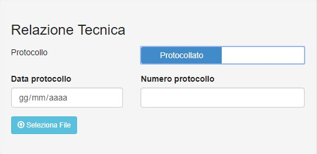
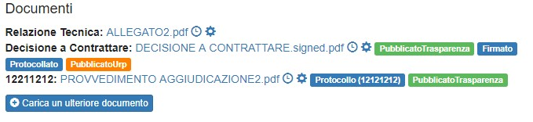
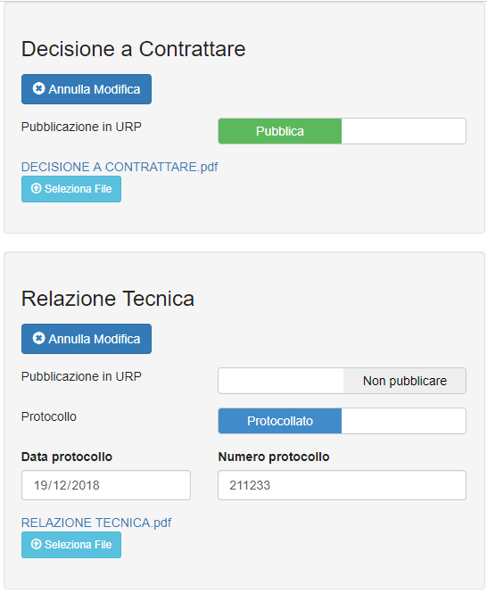

# SCRIVANIA DIGITALE

[TOC]

# INTRODUZIONE

Il presente manuale è una guida all'utilizzo di &quot;Scrivania Digitale&quot; come piattaforma per flussi di lavoro informatizzati - un'applicazione con interfaccia web che permette di definire ed eseguire flussi di lavoro che comportano l'assegnazione di compiti a diversi attori e la raccolta di informazioni e documentazione relativi alle attività amministrative.

Per Flusso (workflow) si intende l'automazione di un processo (procedure amministrative dell’ente). Un Flusso è costituito da una serie di attività elementari: compiti (task), eventualmente cicliche o alternative, da eseguire per ottenere un preciso risultato.

# LA SCRIVANIA DIGITALE

La "Scrivania Digitale" è un’applicazione web che permette la gestione dei flussi Documentali all’interno di un Ente, di un'azienda  o di una qualsiasi realtà strutturata di medie e grandi dimensioni.

La "Scrivania Digitale" ha come obiettivo principale quello di guidare gli utenti predisposti nella gestione dei vari  procedimenti amministrativi. In particolare è stata predisposta per:

- **Dematerializzare** (dematerializzazione del cartaceo)
- **Semplificare** (firma leggera, firma digitale, reingegnerizzazione)
- **Velocizzare** (smistamento ed assegnazione in automatico dei compiti ai diversi attori coinvolti);
- **Organizzare** (ogni utente ha la lista dei propri compiti)
- **Proteggere** (Migliora la protezione delle informazioni: permessi utenti)
- **Tracciare** (tracciamento delle attività con possibilità di monitoraggio dello stato di avanzamento)
- **Informare** (notifiche)
- **Armonizzare** (armonizzazione delle modalità operative di espletamento del procedimento amministrativo da parte delle diverse strutture)
- **Ottimizzare** (ottimizzazione dei processi amministrativi)
- **Facilitare** adempimento agli obblighi Normativi (es. per Acquisti adempimento automatico degli obblighi di trasparenza.)
- **Guidare** (guida e limita l’utente nelle azioni fornendo una maggior aderenza ai processi )
- **Supervisionare** (la ricerca dei flussi permette avere sotto controllo i processi)

Esistono 2 versioni di scrivania digitale, una versione "stand alone" ed una versione integrata.

## ASPETTI TECNOLOGICI

Il software è sviluppato come una web application che può funzionare in modalità standalone, cioè anche senza un application server (es. Tomcat) dedicato.

Il software è stato sviluppato con il framework JHipster, che comprende le seguenti tecnologie:

- **Spring Boot** per IOC e web server
- **Liquibase** per la persistenza dei dati, l'applicazione può usare diversi DMBS (es. H2 per i tests, PostgreSQL per produzione)
- **Hibernate** per le cache e le configuazioni distribuite; l'applicazione può avere diverse istanze per la ridondanza e gestione del carico
- **AngularJS** per le interfacce
- **Activiti** per la gestione dei processi
- **Spring Cloud Config** per la confiurazione esternalizzata
- **Sprint Storage Cloud** per la gestione dei documenti

Le funzionalità sviluppato a supporto dell'esecuzione dei processi amministrativi sono:

- **Gestione dell'autenticazione** che può avvenire attraverso utenze locali all'applicazione, attraverso LDAP oppure attraverso ulteriori gestori di utenze (es. ACE, da aggiungere ad-hoc)
- **Gestione delle autorizzazioni** sia in locale che attraverse gestori esterni (es. ACE)
- **Gestione dei metadati** per ogni processo, compresi gli allegati, e la cronologia dettagliata (chi ha fatto cosa e quando)
- **Gestione dei compiti e delle visibilità** dei flussi amministrativi
- **Notifiche email** sia predefinite (es. "hai un nuovo compito") che personalizzate (es. "Il tuo compito è in attesa da X giorni")
- **Gestione Firma Digitale** interna ai flussi amministrativi (richiede sign-server esterno)
- **Comunicazione con altre applicazioni** attraverso interfacce REST (altre applicazioni possono eseguire compiti in Scrivania ed eventi in Scrivania possono chiamare REST di altre applicazioni)
- **Azioni custom** per ogni tipo di evento (da sviluppare ad hoc)
- **Generazione report e statistiche** in .pdf e in .csv

## VERSIONE STAND ALONE

La versione "Stand Alone" di Scrivania Digitale è una versione che tende ad utilizzare quanto più possibile risorse interne rispetto ad applicazioni aggiuntive. Ad esempio non si appoggia a nessun Repository Documentale esterno per i documenti che vengono inseriti nel DB o nel filesystem locale. Utilizza un sistema interno per la profilazione, l'autenticazione e la gestione delle utenze e dei ruoli assegnati. 

## VERSIONE INTEGRATA	

La versione "Integrata" di Scrivania Digitale è una versione che tende ad integrare quanto più possibile risorse e applicazioni esterne sia open source e commerciali quali: un repository documentale esterno (es. Alfresco, Azure, ...), un sistema di firma remota (es. ARSS Aruba Sign Server); Questa versione è predisposta anche per integrarsi con applicazioni realizzate internamente come l'Anagrafica Centralizzata, e altre applicazioni che possono collegarsi direttamente a flussi specifici. Tali applicazioni avanno una propria gestione interna dei dati e si avvarranno di Scrivania per la parte amministrativa (es. firma digitale). 

# DIAGRAMMA DI FLUSSO

 

Figura 1 - esempio di diagramma di flusso

# VISUALIZZAZIONE

## LE PAGINE

Nella parte superiore della PAGINA appaiono le diverse voci del menù. Ogni utente ha sempre accesso alle seguenti voci del menù: “**I miei compiti**”, “**Ricerca**”, “**HelpDesk**”, “**Manualistica**” e “**Utente**”. Inoltre, a seconda dei ruoli ricoperti dall’utente in Scrivania Digitale, possono apparire altre voci più specifiche.

## I MIEI COMPITI

Il nome "scrivania digitale" deriva dalla trasposizione informatica di uno scenario reale di una scrivania fisica di un utente. Così come sulla scrivania si ha l'abitudine di organizzare le pratiche da lavorare, così la Scrivania Digitale presenta all'utente i vari compiti che devono essere svolti. 

Nella PAGINA “I miei compiti” apparirà così, al centro della pagina, la SEZIONE relativa ai “Compiti di gruppo da prendere in carico” ossia la lista di tutti quei compiti assegnati ad uno specifico ruolo che possono essere presi incarico o svolti dal gruppo di persone che ha quel determinato ruolo. 

Per eseguire un compito assegnato nella lista l’utente potrà scegliere se:

1. Prendere in carico il compito cliccando sulla voce “Prendi in carico”;
2. Visionare il flusso ed eventualmente svolgere il compito cliccando sulla voce “Dettagli Flusso”,

Cliccando, invece sulla voce “Prendi in carico”, quel compito sarà visibile nella SEZIONE di sinistra “compiti assegnati a me”. Questa lista mostra tutti quei compiti che l’utente ha preso in carico o gli sono stati assegnati direttamente. Per ogni compito in questa lista l’utente potrà scegliere se:

1. Restituire il compito al gruppo cliccando sulla voce “Restituisci al gruppo” e quindi renderlo di nuovo visibile nella SEZIONE centrale “Compiti di gruppo da prendere in carico”;
2. Svolgere direttamente il compito cliccando sulla voce “Dettagli Flusso”,

La SEZIONE di destra contiene la lista dei “compiti di gruppo presi in carico da altri” ossia la lista di tutti quei compiti presi in carico da altri utenti che appartengono a gruppi che hanno gli stessi ruoli dell’utente. 

Per ogni SEZIONE viene visualizzato il numero dei compiti presenti in quella specifica lista.

Nel pannello di sinistra è presente un filtro di ricerca che permette di filtrare e ordinare la visualizzazione dei compiti in base agli attributi principali dei flussi.

In ogni SEZIONE, cliccando sul pulsante “Dettagli” verrà visualizzata la PAGINA dei dettagli del flusso e, se disponibili all'utente, le azioni necessarie per il proseguimento del flusso.

## DETTAGLI FLUSSO  

In questa PAGINA sono contenute tutte le informazioni utili del flusso selezionato che possano permettere all’utente di eseguire quel compito specifico.

A sinistra sono presenti tutti i dati relativi alla specifica istanza di flusso.

A destra si ha il diagramma del flusso con evidenziato nello specifico il compito corrente. L’immagine piò essere ingrandita cliccando sopra la thumbnail. 

Tramite il pulsante “Visualizza Cronologia”, situato sotto il digramma è possibile vedere i dettagli dei compiti svolti fino ad ora su quell’istanza di flusso.

Tramite il pulsante “Export Summary” è possibile esportare un flie pdf contente le informazioni dei dettagli del flusso.

In basso a sinistra è presento l’elenco dei documenti che costituiscono il fascicolo per quella determinata istanza di flusso. Cliccando sul link del documento è possibile scaricarlo. Cliccando sull'iconcina a forma di orologio è possibile vederne la cronologia delle modifiche.

Centralmente in basso cliccando sul bottone “Azioni” si può accedere alla maschera con i form di caricamento informazioni e documenti specifici per quel compito. Una volta inserito le informazioni e i documenti necessari è possibile mandare avanti il compito cliccando sul bottone “Invia”. 

Cliccando il bottone “Invia” verranno messi in evidenza tutti i campi obbligatori del form che ancora non sono stati inseriti.

Se tutto va a buon fine il compito è terminato facendo proseguire il flusso verso il passo successivo. Il compito non è più presente nella lista de: “I MIEI COMPITI”. 

## RICERCA FLUSSI 

Nella PAGINA “Ricerca”, è possibile cercare i flussi di cui l’utente ha visibilità divisi in due SEZIONI:

- Quelli ancora attivi, visibili cliccando sul pulsante di sinistra “Flussi attivi” (è la SEZIONE di default)
- Quelli completati (qualunque sia l'esito), visibili cliccando sul pulsante di destra “Flussi completati”

Nella parte sinistra della PAGINA è presente una serie di campi di inserimento e selezione per filtrare i risultati. L’elenco può essere filtrato per attributi comuni ad ogni flusso quali: Identificativo Flusso, Parole Chiave Titolo del Flusso e Descrizione, Utente che ha avviato il Flusso, Numeri di protocollo Documenti e le date relative all’avvio del flusso. 

Selezionando la tipologia del flusso dall’elenco esposto nel campo “Tipologie” vengono presentati campi di filtro per quella tipologia di flusso in modo da poter avere a disposizione una ricerca più specifica.

L’elenco è, di default, ordinato per data di avvio crescente ossia dai flussi avviati prima a quelli più recenti. È possibile modificare l'ordinamento usando i contolli nella parte sinistra della PAGINA.

Una volta avuti i risultati della ricerca, cliccando sul pulsante “Dettagli” sarà visualizzata la PAGINA dove sono contenute tutte le informazioni utili relative a quel flusso.

Tramite il bottone "**Esporta Csv**" è possibile esportare i risultati della ricerca in formato .csv. Questo tipo di export è parametrizzabile per tipologia di flussi mediante il pannello di amministratore

## “HELPDESK”

Nella PAGINA “Help Desk”, è possibile, compilando l’apposito form, inviare una segnalazione all'Help Desk. Le tipologie sono distinte per: problemi Amministrativi e problemi tecnici.

## MANUALISTICA

Nella PAGINA “Manualistica” si trovano i link alla manualistica relativa ai vari tipi di flusso 

# FASI DEL FLUSSO

In genere un flusso può essere suddiviso in sottoflussi. Ad esempio il flusso &quot;Acquisti&quot; può essere principalmente suddiviso in 5 macro-fasi che corrispondono ai Documenti Principali che dovranno essere gestiti all'interno del procedimento:

1. PRE DETERMINA
2. DECISIONE A CONTRATTARE
3. PROVVEDIMENTO DI AGGIUDICAZIONE
4. CONTRATTO FUORI MEPA
5. STIPULA MEPA
6. REVOCA PROCEDURA

 
Figura 18 - Fasi del Flusso

# INTERFACCIA

Nella presente sezione sono definiti gli elementi di base che costituiscono l'interfaccia utente **.**

## Maschera di inserimento dati

La maschera di inserimento dati fornisce all'utente l'interfaccia per poter immettere gli input in maniera corretta e guidata. Ci sono diverse tipologie di campi di inserimento (documento, testo, area di testo, data, ecc..) ognuna specifica per un diverso tipo di dato. In Figura 2 viene riportato un esempio di maschera di inserimento dati relativa al Task &quot; Avvio Flusso .

 
Figura 2- maschera di inserimento dati relativa al Task &quot; Avvio Flusso&quot;

## TIPOLOGIE DI INPUT

### Nota Informativa

La nota informativa corrisponde al set di informazioni che viene visualizzato all'utente come aiuto nella comprensione del compito che deve svolgere.

 
Figura 9 – nota informativa

### Testo

Il testo è un comune campo di input a cui è associata un'etichetta.

 
Figura 3 - Testo

### Area di Testo

Le aree di testo consentono di inserire una descrizione più lunghe, che può essere distribuita su più righe.

Un apposito parametro permette allo sviluppatore di definire il numero massimo di righe (default = 3 righe).

 
Figura 4 - Area di Testo

### Opzioni Scelta multipla

TODO: Inserire immagine

### Opzioni Scelta con Pulsante

Alcuni parametri possono essere selezionati tramite pulsante, come nel caso delle priorità

 
Figura 5 - opzioni scelta con bottoni

### Opzioni Scelta con menù ad albero

Alcuni parametri possono essere selezionati tramite menù ad albero.

 
Figura 6 - opzioni scelta con menù ad albero

### Selezione tramite campo di testo con funzione di autocompletamento

L'input di alcuni campi può essere effettuato tramite campo di testo con funzione di autocompletamento, che permette di selezionare una delle voci visualizzate automaticamente durante la digitazione. Un esempio classico è quello della scelta del nominativo di un utente (Figura 7 - Selezione tramite funzione di autocompletamento).

 
Figura 7 - Selezione tramite funzione di autocompletamento

### Pulsante Azione

I pulsanti Azione permettono di selezionare l&#39;azione desiderata e determinare così la prosecuzione del flusso.

 
Figura 8 – azioni scelta

### Set Multipli di Dati

Alcune entità associate ad un compito sono caratterizzate da un set di dati (es. l'entità &quot;impegno&quot; è caratterizzata da un identificativo, un esercizio, una GAE, etc.).  Nel caso sia necessario inserire più entità dello stesso tipo associate al medesimo compito (es. più impegni per la medesima procedura di acquisto), è possibile cliccare sul pulsante verde con il segno (+) (Figura 10) per far apparire nella maschera un nuovo set di campi identico al precedente.

 
Figura 10 - Set Multipli di Dati

Il risultato di questo inserimento è visibile in Figura 11 – visualizzazione set multiplo di dati

 
Figura 11 – visualizzazione set multiplo di dati

# GESTIONE DOCUMENTI

## Documenti tipo 1 - Documenti tipizzati gestiti Interamente da Sistema

Sono quei documenti &quot;definiti&quot; che vengono gestiti da Scrivania Digitale. Questi documenti vengono modificati, approvati, firmati e protocollati all'interno dell'applicazione. Il sistema prevede anche la gestione di default dei metadati associati (es. pubblicabile in Trasparenza / Urp)

 
Figura 12 – Caricamento Documenti Tipologia 1

## Documenti tipo 2 - Documenti tipizzati caricati nel Sistema

Sono documenti &quot;definiti&quot; che vengono caricati in Scrivania Digitale. Questi documenti vengono caricati all'interno dell'applicazione ma non vengono firmati e protocollati all'interno dell'applicazione. Parametri come il protocollo possono essere inseriti all'atto del caricamento.

 
Figura 13 - Caricamento Documenti Tipologia 2

## Documenti tipo 3 - Documenti Allegati

Sono quei documenti &quot;non definiti&quot; che vengono caricati in Scrivania Digitale. Per questi documenti deve essere specificato il &quot;Tipo Documento&quot; e tutti i metadati gestiti nei documenti di quel determinato flusso.

 
Figura 14 - Caricamento Documenti Tipologia 3

Documenti di questo tipo possono essere caricati extra-flusso da utenti con ruoli speciali mediante apposita interfaccia nei dettagli del flusso.

## Gestione della "etichette" in un flusso

Durante l'esecuzione dei vari Task del Flusso ciascun documento può essere etichettato con informazioni utili come ad esempio quello della pubblicazione sul portale dell'ente &quot;**pubblicabile in trasparenza**&quot; o &quot;**pubblicabile URP**".  La gestione di queste etichette dipende dalle specifiche di ogni flusso. Possiamo riportare un esempio della gestione di queste 2 etichette per il flusso "Acquisti":

- Per i documenti di tipo 1 e 2 viene gestita dal sistema.
- Per gli allegati (tipo 3) è settata da chi inserisce il documento; modificabile da altri utenti durante la gestione del proprio task (selezionando il bottone modifica).

Quando il sistema completa alcune fasi determinate, i documenti &quot;pubblicabili in trasparenza&quot; o &quot;pubblicabili URP&quot; saranno effettivamente resi rispettivamente disponibili per la pubblicazione in trasparenza e in URP. Le rispettive etichette cambieranno in "**PubblicatoTrasparenza**" o "**PubblicatoURP**".

 
Figura 15 - etichette sui documenti

## Gestione delle etichette - extra flusso

Ruoli che hanno permessi particolari possono in qualsiasi momento cambiare lo stato di pubblicazione di un documento. Per modificare i documenti basta andare sui dettagli del flusso e cliccare la &quot;rotellina&quot; relativa al documento che si vuole modificare come indicato in Figura 16

 
Figura 16 - gestione documenti extra flusso

## Gestione della pubblicazione - parametri di Protocollo (data e nr)

- Per i documenti di tipo 1 il protocollo viene inserito manualmente nei compiti (task) appositi. Al completamento con successo del Compito il documento verrà etichettato con l'etichetta &quot;Protocollato&quot;
- Per i documenti di tipo 2 e 3 sono settati da chi inserisce il documento modificabile da altri utenti durante la gestione del proprio task (selezionando il bottone modifica) e solo da ruoli specifici in qualsiasi momento). Al completamento con successo del Compito il documento verrà etichettato con l'etichetta &quot;Protocollo (nr protocollo)&quot;

È importante inserire sempre il numero di protocollo, perché è uno di quei parametri che può essere usato nel pannello Ricerca. Il risultato indicherà il flusso che possiede quel documento. Dai dettagli del flusso sarà possibile recuperare tutti i dati necessari e scaricare il file.

## Modifica Documenti

I documenti inseriti posso essere modificabili nel task (se il task lo prevede), o nella schermata dettagli dai ruoli a cui è stato dato il permesso di cambiarli. Potranno essere cambiati tutti i metadati e caricato un nuovo file in sostituzione del vecchio (nuova versione del documento) come già descritto nel paragrafo Gestione Documenti a meno che che il file non sia stato già firmato e protocollato (Documenti tipo 4)

## Documenti tipo 4 - Documenti Firmati e Protocollati all'interno di Scrivania Digitale

Sono quei documenti del tipo 1 che sono già stati firmati e protocollati all'interno dell'applicazione. Questi Documenti non possono essere modificati semplicemente. Utenti identificati come responsabili per quel specifico flusso e struttura hanno la possibilità di effettuare un cambiamento:

1. Per &quot;**Rettifica**&quot; per cui:
     - Verrà caricato un nuovo file di rettifica firmato e protocollato esternamente
     - Verrà inserito il suo nr di protocollo
     - Verranno copiati gli altri metadati dal documento principale
2. Per &quot;**Sostituzione**&quot; in quei casi di per cui:
     - Verrà caricato un nuovo file di rettifica firmato e protocollato esternamente in sostituzione del precedente (sarà una nuova versione dello stesso file)
     - Verrà inserito il suo nr di protocollo
     - Verranno copiati gli altri metadati dal documento principale
     - Verrà inserita la &quot;motivazione della sostituzione&quot;

 

